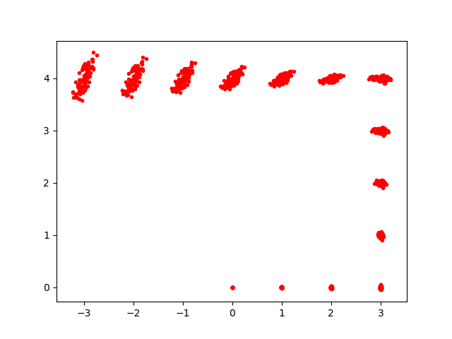
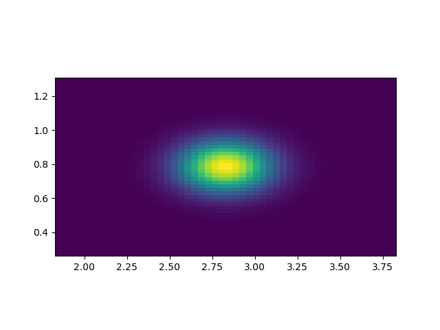

# Plantilla de código para modelo de movimiento y modelo de sensor

## Instrucciones generales

- Hay dos `packages` de ROS, los directorios `marker_msgs` y `practica2`
- Copia los `packages` en el directorio `src` de tu *workspace* de ROS (si no lo tenías, crea uno) 
- Compila los `packages`con `catkin_make` desde el directorio raíz de tu *workspace*
- Recuerda que en cada terminal debes hacer `source nombre_del_workspace/devel/setup.bash` para tener acceso a lo definido en cualquier `package` del *workspace*. En especial necesitarás los mensajes de ROS definidos en el `package` `marker_msgs`.

## El modelo de movimiento

### Implementación

Debes implementar el código en el archivo `practica2/src/modelo_movimiento.py`. 

Hay dos funciones a implementar:

- `sample_motion_model(d_trans, d_rot1, d_rot2, sample)` se corresponde con el algoritmo de la transparencia titulada “Modelo de movimiento de odometría muestreado”, número 23 del tema 2, parte 2.

- `odometry_to_relative(odom_old, odom_new)` se corresponde con el algoritmo de la transparencia titulada "Convertimos la odometría en relativa", número 11 del tema 2, parte 2.

En `modelo_movimiento.py` hay comentarios al fuente que te indican más detalles sobre la implementación.

Léete el apartado sobre quaternions y orientaciones que aparece al final del documento, lo necesitarás para implementar este modelo.

### Prueba

se incluye un *script* `plot_modelo_movimiento.py` en el que se generan N partículas que se van desplazando de un punto a otro según el modelo de movimiento y una odometría simulada en el archivo `odometria.txt`. Este archivo indica las poses sucesivas del robot. Suponiendo que ya has implementado el modelo de movimiento, para probarlo, puedes ejecutar una orden como:

`python plot_modelo_movimiento odometria.txt 100`

donde 100 es el número de muestras.

La siguiente figura se ha generado con 100 muestras, el fichero `odometria.txt` incluido en la plantilla, y los valores de alfa definidos por defecto en `modelo_movimiento.py`. En ella que se ve cómo va creciendo la incertidumbre en la posición conforme se mueve más lejos el robot. Puedes variar esta incertidumbre cambiando el valor de los parámetros alfa.





## El modelo del sensor

### Implementación

Debes implementar el código en el archivo `practica2/src/modelo_sensor.py`. “Modelo de sensor de distancia y orientación” del tema 2, parte 3.

Hay una función a implementar: `landmark_detection_model(z, x, m)`, que se corresponde con el algoritmo de la transparencia titulada “Modelo de sensor de distancia y orientación” del tema 2, parte 3. 

En el `modelo_sensor.py` hay comentarios al fuente que te indican cómo hacer la implementación.

Léete el apartado sobre quaternions y orientaciones que aparece al final del documento, lo necesitarás para implementar este modelo.

### Prueba

se incluye un *script* `plot_modelo_sensor.py` en el que se simula el modelo del sensor para diferentes valores de z=(distancia,ángulo). Para simplificar, supone al robot en la pose (0,0,0) y hay que pasarle las coordenadas `x,y` donde está el landmark, por ejemplo:

`python plot_modelo_sensor.py 2 2`

Como salida obtendremos una gráfica de la "probabilidad" de la medida para distintos valores de distancia y ángulo, que debería ser máxima para la distancia y ángulo reales, en este caso la distancia sería `sqrt(2*2 + 2*2)` y el ángulo 45 grados o 0,785 radianes. La forma exacta dependerá de las desviaciones típicas en distancia y ángulo definidas en `modelo_sensor.py`. La que se muestra está generada con los valores por defecto.




## Apéndice: orientaciones en ROS. *Quaternions*

En ROS las orientaciones con respecto a los ejes se dan en forma de *quaternions*. Sin embargo en las fórmulas que hemos visto en clase se usan orientaciones con respecto a cada uno de los ejes, también llamadas en otros contextos "roll" (eje x), "pitch" (eje y) y "yaw" (eje z). En nuestro caso ya que el robot rueda por el suelo, solo tenemos giro alrededor del eje z o *yaw*. En clase usamos esto porque es infinitamente más intuitivo que usar *quaternions*.

En una `Pose` de ROS la orientación (propiedad `orientation`) está almacenada en un *quaternion*. Para poder obtener el *yaw* puedes usar la función de ROS `euler_from_quaternion`

```python
from tf.transformations import euler_from_quaternion

#suponemos que hay una Pose guardada en la variable "sample"
#euler_from_quaternion nos devuelve una tupla con 3 valores, roll, pitch, yaw pero solo nos interesa yaw
#por eso para roll y pitch usamos la variable "anónima" _
_,_,theta = euler_from_quaternion([sample.orientation.x, sample.orientation.y, 
                                    sample.orientation.z, sample.orientation.w])
```

También puedes tener el caso inverso en que tengas el *yaw* y necesites guardarlo en una `Pose`. Para convertirlo en *quaternion* necesitas `quaternion_from_euler`:

```python
from tf.transformations import quaternion_from_euler

#supongamos que el yaw o giro en Z lo tenemos guardado en una variable "yaw"
#convertimos roll=0, pitch=0, yaw a quaternion en forma de array
q_array = quaternion_from_euler(0,0,yaw)
#pero si queremos guardarlo en una Pose en ROS necesitamos un objeto Quaternion
q = Quaternion(q_array[0], q_array[1], q_array[2], q_array[3])
#ahora ya podemos guardarlo como la orientación de la Pose. Cámbialo por la variable que tú uses para la pose
miPose.orientation = q
```


